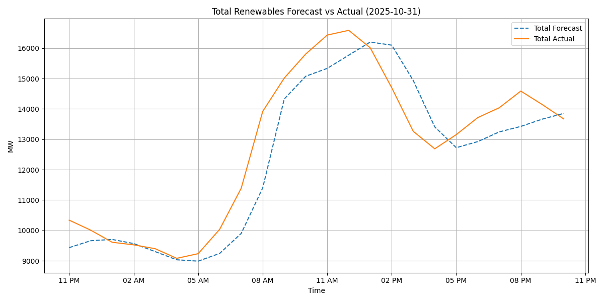
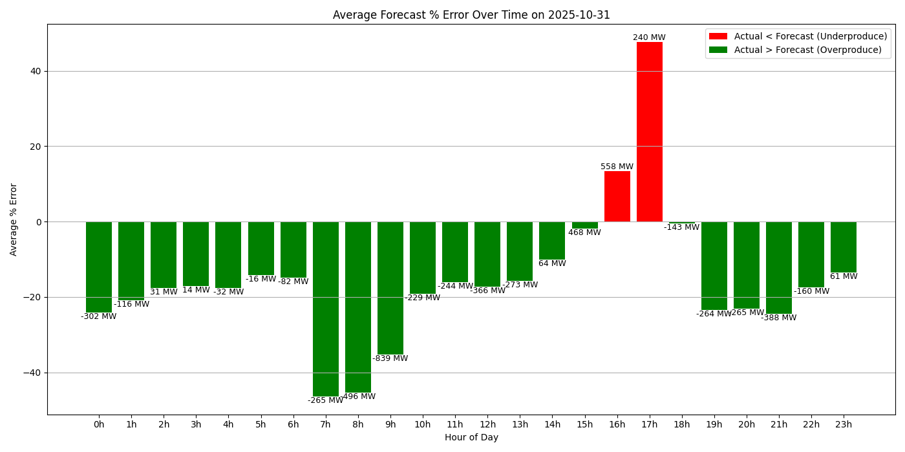

# Renewables Forecast vs Actual

This project analyzes and visualizes the accuracy of renewable energy forecasts compared to actual production across various sources (solar, wind, etc.) in France.

---

## 🔗 Data Pipeline

We collect raw data daily from **RTE (Réseau de Transport d'Électricité)** using **two API calls**:

1. One to retrieve **forecast values**
2. One to retrieve **actual production values**

These values are stored in **Raw** tables.
Then, these tables are parsed and processed into **Base** before finally being aggregated into the **CDM** (common data model) layer.
One new CDM file is hence created every day.

The files in the CDM are then used to generate a series of insightful visualizations that are embedded in this readme daily.
The graphs presented below are therfore up to date and show the accuracy of renewable energy production forecasts compared to actual production across various sources (solar, wind, etc.) in France.

---

## 📊 Visualizations

### 1. Total Forecast vs Actual (MW)



Compares the total forecasted renewable production against the actual production over time.

---

### 2. Forecast Error Over Time (MW)



Shows when production was over- or under-estimated.  
**Green = overproduction**, **Red = underproduction**.  
Labels show the MW delta for each day.

---

### 3. Forecast vs Actual by Production Type


Displays forecast vs actual production for each renewable source type over time.

---

### 4. Average Forecast Error by Hour


Shows the average percentage error by hour of day, aggregated across all available dates.

---

### 5. Forecast Bias by Production Type


Visualizes which sources are consistently over- or under-forecasted on average.

---

## 🗃️ Data

Each row in the processed dataset includes:
- `start_date`
- `forecast_value`
- `actual_value`
- `production_type`

---

## 📦 Dependencies

- pandas  
- matplotlib  
- seaborn  
- pathlib

Install them with:

```bash
pip install -r requirements.txt
