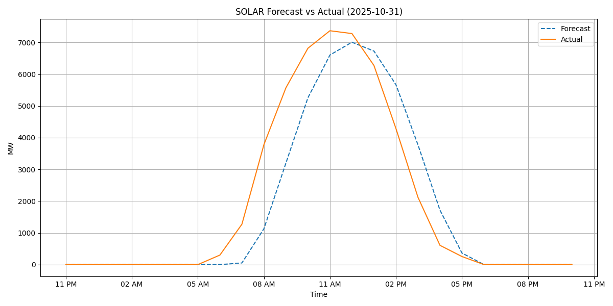
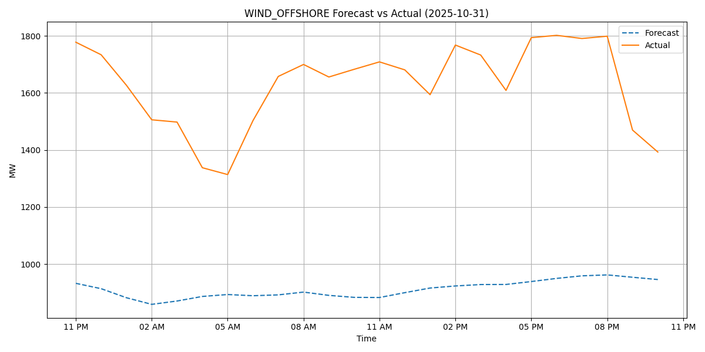
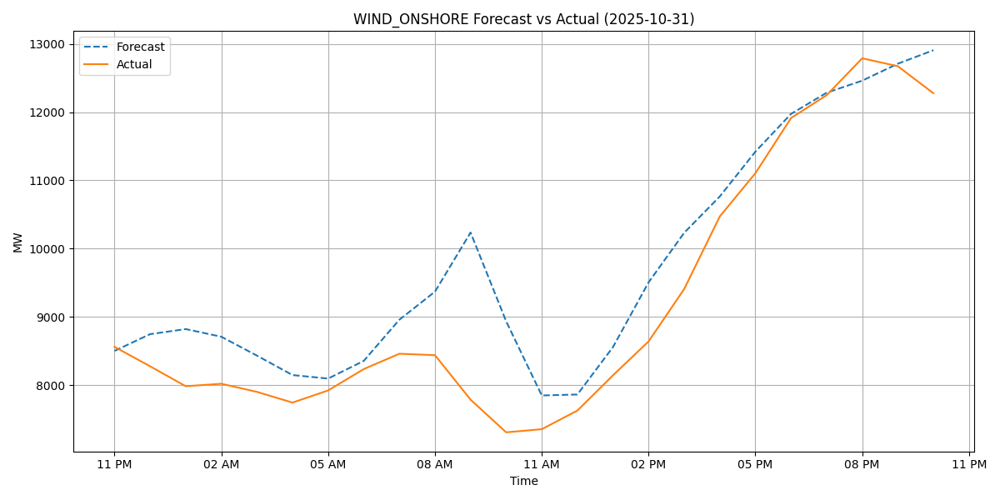

# Renewables Forecast vs Actual

This project analyzes and visualizes the accuracy of renewable energy forecasts compared to actual production across various sources (solar, wind, etc.) in France.

---
👆 [Tableau Public Visualisation of Historical data](https://public.tableau.com/views/RenewableProductionOverviewForecastedvsActualProduction/RenewableProductionOverview?:language=en-GB&publish=yes&:sid=&:redirect=auth&:display_count=n&:origin=viz_share_link)


## 🔗 Data Pipeline

We collect raw data daily from **RTE (Réseau de Transport d'Électricité)** using **two API calls**:

1. One to retrieve **forecast values**
2. One to retrieve **actual production values**

These values are stored in **Raw** tables.
Then, these tables are parsed and processed into **Base** before finally being aggregated into the **CDM** (common data model) layer.
One new CDM file is hence created every day.

The files in the CDM are then used to generate a series of insightful visualizations that are embedded in this readme daily.
The graphs presented below are therfore up to date and show the accuracy of renewable energy production forecasts compared to actual production across various sources (solar, wind, etc.) in France.

---

## 📊 Visualizations

### 1. Total Forecast vs Actual (MW)


Compares the total forecasted renewable production against the actual production over time.

---

### 2. Solar Forecast vs Actual (MW)



Compares the solar forecasted renewable production against the actual production over time.

---

### 3. OffShore Wind Forecast vs Actual (MW)



Compares the offshore wind forecasted renewable production against the actual production over time.

---

### 4. OnShore Wind Forecast vs Actual (MW)



Compares the onshore wind forecasted renewable production against the actual production over time.

---

### 5. Forecast Error Over Time (MW)


Shows when production was over- or under-estimated.  
**Green = overproduction**, **Red = underproduction**.  
Labels show the MW delta for each day.

---

## 🗃️ Data

Each row in the CDM files includes:
- `start_date`
- `forecast_value`
- `actual_value`
- `production_type`

---

## 📦 Dependencies

- pandas  
- matplotlib  
- seaborn  
- pathlib

Install them with:

```bash
pip install -r requirements.txt
```
---

## 📄 RTE API Documentation

- ⚡ [RTE Open Data Portal](https://data.rte-france.com/)
- 📘 [API Docs - Actual Generation per Production Type](https://data.rte-france.com/catalog/-/api-doc/Actual%20generation%20per%20production%20type)
- 📘 [API Docs - Generation Forecast](https://data.rte-france.com/catalog/-/api-doc/Generation%20forecast)

To access the APIs, you must register for an API key on the RTE Open Data portal.
